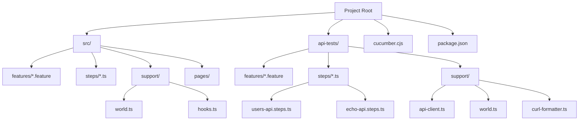

<div align="center">
  
</div>

# Running and Using Playwright with Cucumber Base Repo

This guide explains how to run and use Playwright with Cucumber for automated testing of web applications.

**Prerequisites**

- Node.js installed on your system
- A project set up with Playwright and Cucumber

**Step 1: Install Playwright and Cucumber**

To install Playwright and Cucumber, run the following commands in your project directory:

```bash
npm install playwright
npm install @cucumber/cucumber
```

**Step 2: Set up Playwright**

Create a new file `playwright.config.js` with the following content:

```javascript
module.exports = {
	// Your Playwright configuration
};
```

**Step 3: Write Cucumber Tests**

Create a new file `features/login.feature` with the following content:

```gherkin
Feature: User Authentication

  Scenario: Successful login with valid credentials
    Given I am on the login page
    When I login with valid credentials
    Then I should be logged in successfully

  Scenario: Failed login with invalid credentials
    Given I am on the login page
    When I login with invalid credentials
    Then I should see an error message
```

**Step 4: Implement Step Definitions**

Create a new file `steps/login.steps.ts` with the following content:

```typescript
import { Given, When, Then } from '@cucumber/cucumber';
import { expect } from '@playwright/test';
import { LoginPage } from '../pages/login.page';
import { World } from '../support/world';

Given('I am on the login page', async function (this: World) {
	const loginPage = new LoginPage(this.page);
	await loginPage.navigate('/login');
});

When('I login with valid credentials', async function (this: World) {
	const loginPage = new LoginPage(this.page);
	await loginPage.login(process.env.USERNAME!, process.env.PASSWORD!);
});

Then('I should be logged in successfully', async function (this: World) {
	await expect(this.page.getByText('Welcome')).toBeVisible();
});
```

**Step 5: Run the Tests**

To run the tests, execute the following command in your project directory:

```bash
npx cucumber-js
```

## Project Structure



## Code Locations

### Configuration

- [package.json](./package.json) - Contains test scripts and dependencies
- [cucumber.cjs](./cucumber.cjs) - Cucumber configuration with profiles

### API Tests

- [api-tests/features/](./api-tests/features/) - API test feature files
- [api-tests/steps/echo-api.steps.ts](./api-tests/steps/echo-api.steps.ts) - Echo API test steps
- [api-tests/steps/users-api.steps.ts](./api-tests/steps/users-api.steps.ts) - User API test steps
- [api-tests/support/api-client.ts](./api-tests/support/api-client.ts) - API client for making requests
- [api-tests/support/world.ts](./api-tests/support/world.ts) - Custom world for API tests
- [api-tests/support/curl-formatter.ts](./api-tests/support/curl-formatter.ts) - Formats requests as curl commands

### UI Tests

- [src/features/](./src/features/) - UI test feature files
- [src/steps/](./src/steps/) - UI test step definitions
- [src/pages/](./src/pages/) - Page object models
- [src/support/world.ts](./src/support/world.ts) - Custom world for UI tests
- [src/support/hooks.ts](./src/support/hooks.ts) - Setup and teardown hooks

## Running Tests

### Command Line

- `npm test` - Run UI tests
- `npm run test:api` - Run API tests
- `npm run test:all` - Run all tests
- `npm run test:api:smoke` - Run API smoke tests
- `npm run test:echo` - Run Echo API tests specifically

### VS Code Debugging

The project includes several VS Code launch configurations for running tests:

1. **Run All UI Tests**
   - Runs all UI tests in the `src/features` directory
   - Access via VS Code Debug panel (F5)

2. **Run All API Tests**
   - Runs all API tests in the `api-tests/features` directory
   - Access via VS Code Debug panel (F5)

3. **Run Specific Test File**
   - Run a specific feature file by opening it and using the debug configuration
   - Works for both UI and API tests
   - Access via VS Code Debug panel (F5)

4. **Run Tests with Tags**
   - Run tests filtered by tags (e.g., @smoke, @regression)
   - Prompts for tag input when launched
   - Access via VS Code Debug panel (F5)

5. **Debug UI Tests in Playwright**
   - Runs UI tests with Playwright's debugger
   - Opens Playwright's debug window for step-by-step debugging
   - Access via VS Code Debug panel (F5)

6. **Debug API Tests in Playwright**
   - Runs API tests with Playwright's debugger
   - Opens Playwright's debug window for step-by-step debugging
   - Access via VS Code Debug panel (F5)

7. **Debug Specific UI Test in Playwright**
   - Debug a specific UI test file with Playwright's debugger
   - Opens Playwright's debug window for step-by-step debugging
   - Access via VS Code Debug panel (F5)

8. **Debug Specific API Test in Playwright**
   - Debug a specific API test file with Playwright's debugger
   - Opens Playwright's debug window for step-by-step debugging
   - Access via VS Code Debug panel (F5)

### Using Playwright Debugger

When using the Playwright debugger configurations:
1. The test execution will pause at each step
2. You can inspect the page state, network requests, and console output
3. Use the debug controls to step through the test
4. The debugger window provides access to:
   - Page state inspection
   - Network request monitoring
   - Console output
   - Step-by-step execution controls

### Running Tests with Tags

You can run tests with specific tags using either:

1. Command line:
   ```bash
   npx cucumber-js --tags @smoke
   ```

2. VS Code launch configuration:
   - Select "Run UI Tests with Tags" or "Run API Tests with Tags"
   - Enter the tag when prompted (e.g., @smoke, @regression)

### Running Tests in Parallel

To run tests in parallel, use the `--parallel` flag:

```bash
npx cucumber-js --parallel 2
```

### Running Tests with Specific Browser

To run tests with a specific browser:

```bash
npx cucumber-js --world-parameters '{"browser":"chromium"}'
```

**Documentation Links**

- [Playwright Documentation](https://playwright.dev/docs/intro)
- [Cucumber.js Documentation](https://cucumber.io/docs/cucumber/)

By following these steps, you can successfully integrate Playwright with Cucumber for automated testing of web applications.
